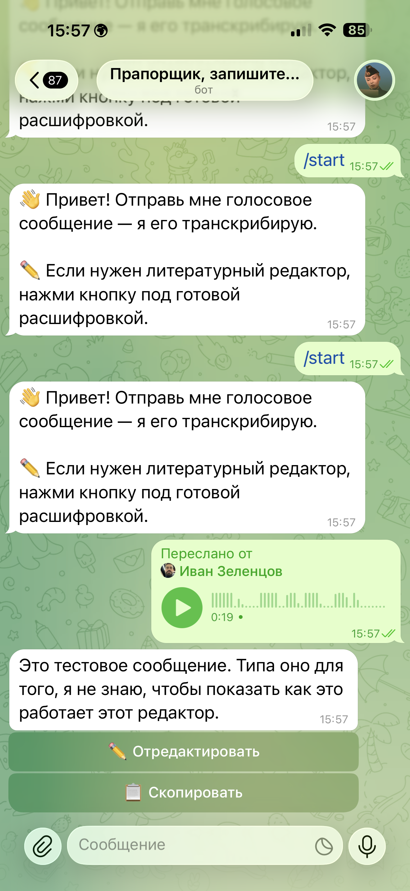
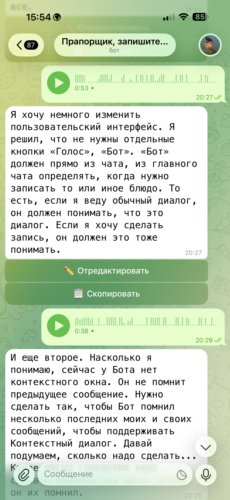
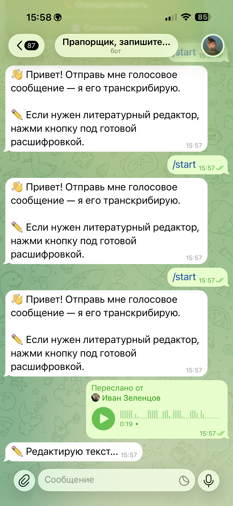
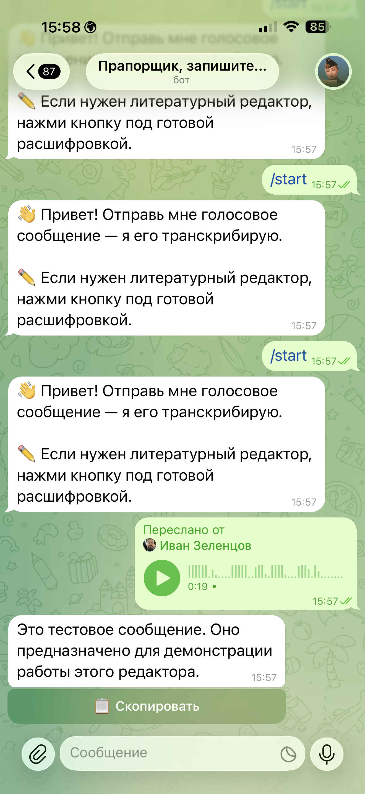

# Voice To Text Bot

Telegram-бот для транскрибации голосовых сообщений и аудиофайлов в текст с опциональной GPT-правкой расшифровки.

Это очищенная портфельная версия. В репозитории нет production `.env`, пользовательских данных, аудиофайлов, приватных транскриптов, локальных баз и служебных заметок деплоя.

## Демо

<p align="center">
  
  
</p>
<p align="center">
  
  
</p>

Слева направо, сверху вниз: `/start` и первая расшифровка, длинный связный транскрипт, запуск GPT-редактора по кнопке, итоговый отредактированный текст с кнопкой «Скопировать».

## Что показывает проект

- Сценарий speech-to-text внутри Telegram.
- Интеграцию с AssemblyAI.
- Ручную GPT-правку текста по кнопке после транскрибации.
- UX на inline-кнопках для редактирования и копирования результата.
- Docker-сценарий запуска.
- AI-assisted development: постановка задачи, реализация через coding assistants, ручная проверка сценариев, очистка и документация.

## Пользовательский сценарий

1. Пользователь отправляет голосовое сообщение или аудиофайл.
2. Бот скачивает файл и отправляет его в AssemblyAI.
3. Бот возвращает сырой transcript.
4. Пользователь может нажать `Отредактировать`, чтобы применить GPT-правку именно к этой расшифровке.
5. Пользователь может нажать `Скопировать`, чтобы получить текст в удобном для копирования monospace-формате.

Редактор специально не сделан глобальным режимом: сначала всегда доступна исходная расшифровка, а GPT-правка применяется только по явному действию пользователя.

## Стек

- Python 3.11
- aiogram 3
- AssemblyAI
- OpenAI API
- Docker

## Запуск

```bash
python -m venv .venv
source .venv/bin/activate
pip install -r requirements.txt
cp .env.example .env
python bot.py
```

Нужные переменные окружения:

```env
TELEGRAM_BOT_TOKEN=your_telegram_bot_token
ASSEMBLYAI_API_KEY=your_assemblyai_api_key
OPENAI_API_KEY=your_openai_api_key
OWNER_ID=your_telegram_user_id
```

`OWNER_ID=0` использовать только для локальных экспериментов, где не нужен контроль доступа.

## Docker

```bash
docker build -t voice-to-text-bot .
docker run -d \
  --name voice-to-text-bot \
  --restart unless-stopped \
  --env-file .env \
  voice-to-text-bot
```

## Структура

```text
bot.py             Telegram handlers и inline-button workflow
config.py          загрузка env и промпт редактора
openai_client.py   вызовы AssemblyAI и OpenAI API
Dockerfile         Docker-образ
requirements.txt   Python-зависимости
```

## Безопасность

- Не коммитить `.env`.
- Не коммитить реальные аудиофайлы и транскрипты.
- В реальном деплое оставлять `OWNER_ID` включённым.
- GPT-правка может менять стиль текста; если важна дословность, сверяться с исходной расшифровкой.

## Портфельная рамка

Проект представлен как прототип автоматизации, собранный с помощью AI-assisted development. Фокус: проектирование пользовательского сценария, промптов и контрольных решений, интеграция API и практичный UX, а не заявление о ручной production backend-разработке.
